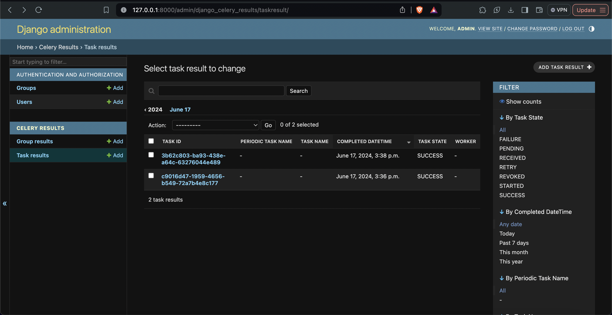
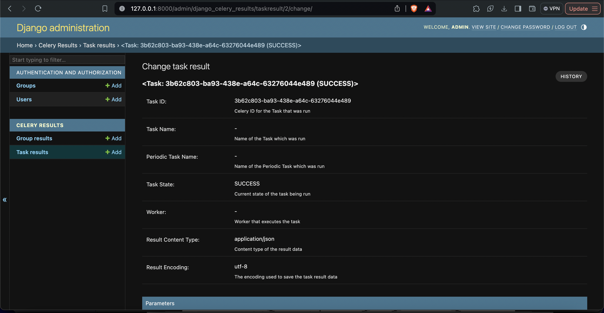
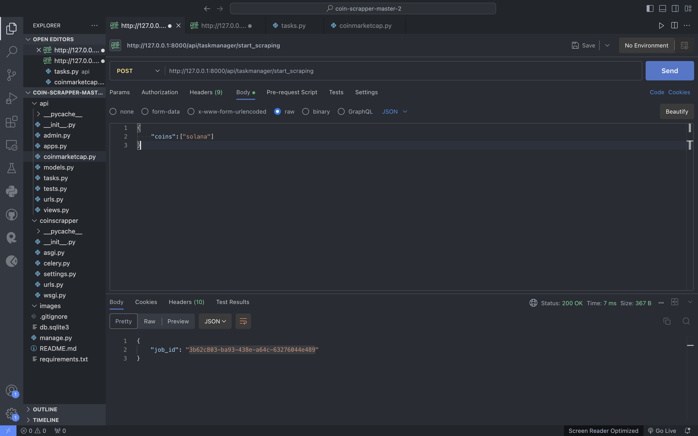
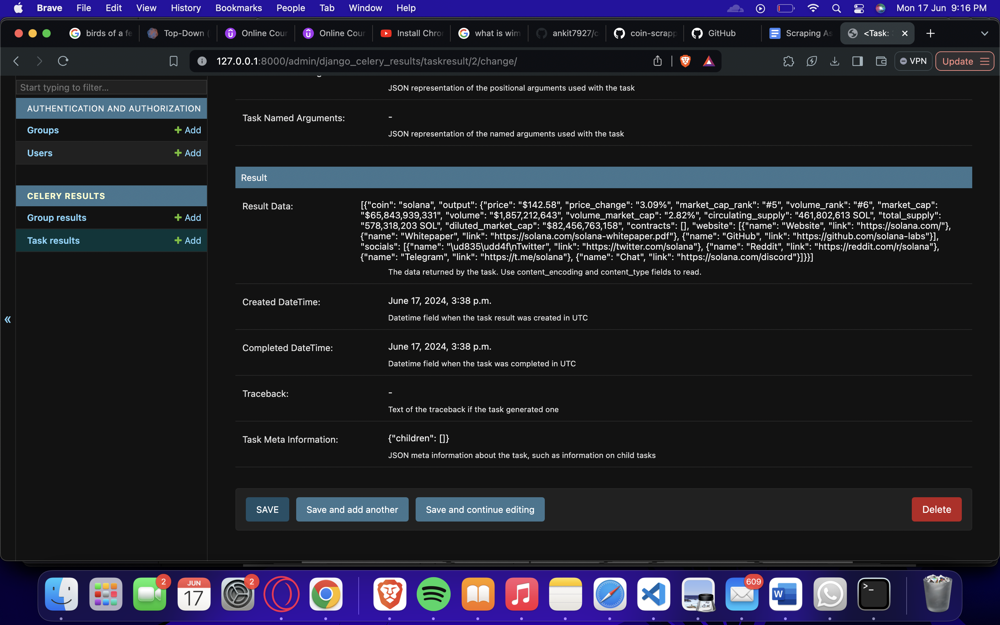
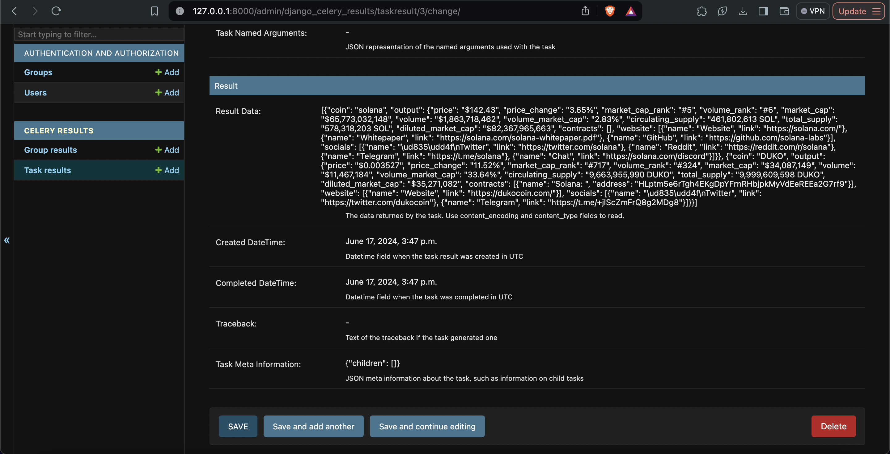

## Coin Scraper
<p>Crypto currency data scraping app</p>
<br />

<h3>Output</h3>

<table>
    <tr>
        <td>
            <p></p>
            
        </td>
        <td>
            <p></p>
            
        </td>
    </tr>
    <tr>
        <td>
            <p></p>
            
        </td>
        <td>
            <p></p>
            
        </td>
    </tr>
    <tr >
        <td colspan="2">
            <p></p>
            
        </td>
    </tr>
</table>


<h3>Installation</h3>

<p>1. install dependencies</p>

```
pip install -r requirements.txt
```

<p>2. start redis server</p>

```
$ redis-server
```

<p>3. run celery worker </p>

```
celery --app=coinscrapper worker --loglevel=info --pool=threads
```

<p>4. run app</p>

```
python manage.py runserver
```